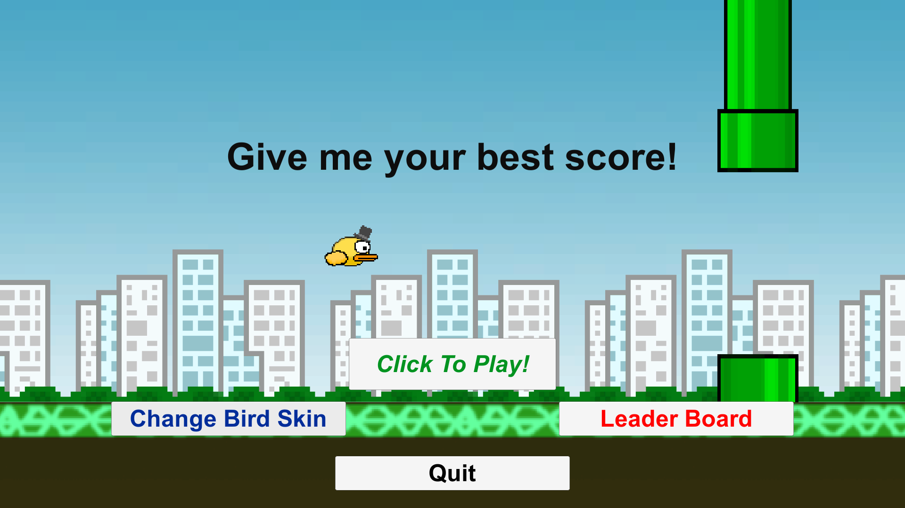

# Cristin's Homepage

[https://github.com/cr1d3v](https://github.com/cr1d3v)

## About The Project

This is a 'flappy bird' clone game developed from scratch. The game contains new features such as customizable skins, a new world, re-designed score counter, etc. As well as, shares numerous similarities with the original flappy bird game. The game was developed in C# with the help of Unity. 

During the development life cycle the game brought back some great childhood memories. It is truly fascinating how such a simple yet addictive product was created with little to no marketing pushes and managed to strike and become an all-time hit. 

PS: Please note, the 'Leader Board' button is not working, it was a feature that I thought of implementing but didn't get around to finishing yet.

## Demo

Hey 👋, I left some screengrabs below, showcasing the game in action!

Main Menu!
---



During the GamePlay!
---


## Stack

- [C# - Programming Language](https://learn.microsoft.com/en-us/dotnet/csharp/tour-of-csharp/) - A general-purpose programming language designed by Microsoft.
- [Unity - Game Engine](https://unity.com/) - A cross-platform game engine developed by Unity Technologies.

## How to run the application ?

```
To Run the Application:
Navigate toward -> \..\Flappy-Bird-Clone-Game\FYP-Artifact-Sub\Game_executable\FYP Artifact.exe

To inspect the code: 
Navigate toward -> \..\Flappy-Bird-Clone-Game\FYP-Artifact-Sub\ArtifactFYP\ 'this is the root folder thus contains the .sln files'

Other info:
Within the 'ArtifactFYP' folder there's also the “Assets” folder that in essence is the brain of the entire project
the following contains the classes, resources such as sounds, graphics,
game add-ons such as greenPipingObj and ScoringPeremiterObj within the game,
as well as the saved flapping actions and scenes.
```
---

Thank you for having a look!
